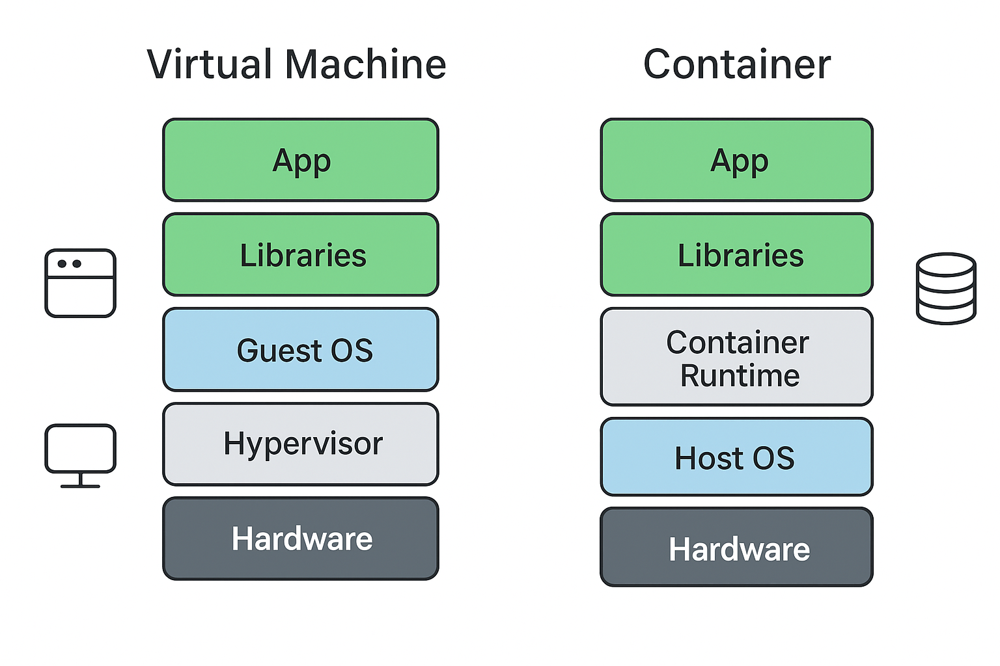

# 🧩 Day 0: Understanding Servers, Virtual Machines & Containerization

## 🎯 Goal
Before you touch Docker, understand **why containers exist**, how they’re different from **VMs**, and what makes them faster, lighter, and more efficient.

---

## 🖥️ 1. Bare Metal Servers (Traditional Infrastructure)
**What it is:**  
- The physical server (actual hardware).  
- You install an operating system (like Windows Server or Linux) **directly on hardware**.  
- All apps share the same OS.

**Problems:**
- 🧱 No isolation — one crash affects others.  
- 🐢 Scaling is hard — need a new physical server.  
- ⚙️ Resource waste — can’t fully utilize hardware.

---

## 🧱 2. Virtual Machines (VMs)
**What it is:**  
- You install a **Hypervisor** (like VMware, VirtualBox, or Hyper-V) on top of hardware.  
- The hypervisor divides the physical machine into **multiple virtual machines**, each having:
  - Its **own OS (called guest OS)**
  - Its **own kernel**
  - Its **own libraries and apps**

### ⚙️ VM Architecture
```
+--------------------------------------+
| Applications                         |
| (Web, DB, etc.)                      |
+--------------------------------------+
| Guest OS (Ubuntu, Windows, etc.)     |
+--------------------------------------+
| Virtual Machine (VM1, VM2, VM3...)   |
+--------------------------------------+
| Hypervisor (VMware, Hyper-V)         |
+--------------------------------------+
| Host OS + Hardware                   |
+--------------------------------------+
```

### ⚠️ Issues with VMs
| Issue | Explanation |
|--------|-------------|
| **Slow startup** | Each VM boots a full OS. |
| **Storage heavy** | Each VM image can be several GBs. |
| **Resource duplication** | Each VM duplicates OS kernels and libraries. |
| **Lower efficiency** | CPU & memory overhead due to hypervisor. |

---

## 🐳 3. Containers (Containerization Era)
**What it is:**  
- Containers run **on top of the host OS kernel**, sharing it.  
- Each container has its own **isolated user space**, app files, and dependencies — but **doesn’t need a full OS**.

### ⚙️ Container Architecture
```
+--------------------------------------+
| App + Dependencies (Container 1)     |
| App + Dependencies (Container 2)     |
+--------------------------------------+
| Container Runtime (Docker)           |
+--------------------------------------+
| Host OS (Linux / Windows)            |
+--------------------------------------+
| Hardware                             |
+--------------------------------------+
```

So instead of running *a full OS per app*, containers **share the host OS kernel** but stay logically isolated.

---
## 🖼️ VM vs Container Architecture Diagram



---


## 📂 4. Files Shared vs Not Shared

| Category | Virtual Machine | Container |
|-----------|----------------|------------|
| **Kernel** | Separate kernel per VM | Shared host kernel |
| **Operating System files** | Own OS files | Shared OS kernel, separate filesystem for app |
| **Libraries & Dependencies** | Separate copy for each VM | Packaged with container image |
| **System Resources (CPU, RAM)** | Allocated via hypervisor | Shared dynamically via Docker engine |
| **File Access** | Can’t access host filesystem unless mounted | Can access host filesystem if mounted (via `-v`) |

---

## ⚡ 5. Why Containers Save Space & Resources

| Feature | Virtual Machine | Container |
|----------|----------------|------------|
| **OS per instance** | ✅ Yes (heavy) | ❌ No (light) |
| **Startup time** | Minutes | Seconds |
| **Memory usage** | 100s of MBs – GBs per VM | 10s of MBs per container |
| **Storage** | Large disk image per VM | Small layered image |
| **Isolation level** | Strong (via hypervisor) | Lightweight (via namespaces, cgroups) |
| **Resource efficiency** | Low | High |

🧠 **Example:**  
Running 10 apps →  
- In VMs → 10 OSes + 10 app stacks = GBs of space  
- In Containers → 1 OS (shared) + 10 isolated app environments = MBs of space  

---

## 🧩 6. Core Containerization Concepts

| Concept | Explanation |
|----------|--------------|
| **Image** | A read-only template containing app + dependencies |
| **Container** | A running instance of an image |
| **Container Engine** | Software like Docker that manages containers |
| **Registry** | A place where images are stored (e.g., Docker Hub) |
| **Namespace** | Isolates processes, network, and files per container |
| **Cgroups (Control Groups)** | Limit CPU and memory for containers |

---

## 🌍 7. Container Workflow vs VM Workflow

### Traditional VM Approach
1. Create VM → Install OS → Install dependencies → Deploy app

### Container Approach
1. Write Dockerfile → Build image → Run container instantly anywhere

This means:
- Dev, QA, and Prod can run the same container image.  
- No “works on my machine” issues anymore.

---

## 🧠 8. Summary Table: VMs vs Containers

| Feature | Virtual Machine | Container |
|----------|----------------|------------|
| Boot Time | Minutes | Seconds |
| OS per Instance | Yes | No (shared) |
| Resource Usage | Heavy | Light |
| Portability | Moderate | Very High |
| Isolation | Strong (hardware level) | Strong (software level) |
| Scalability | Slower | Instant scaling |
| File System | Separate for each VM | Layered & shared (copy-on-write) |
| Deployment Speed | Slow | Fast |
| Use Case | Full OS isolation | App-level isolation |

---

## 🧠 9. Simple Analogy

**Virtual Machines:** Like running multiple **houses** — each with its own foundation, walls, and roof.  
**Containers:** Like running multiple **apartments** inside one building — each private, but sharing the same foundation (kernel).

---

## 🔍 10. Practical Visualization

| Layer | VM | Container |
|--------|---|-----------|
| Hardware | Shared | Shared |
| OS Kernel | Separate per VM | Shared |
| App Dependencies | Separate | Packaged per container |
| Execution | Slow | Fast |
| Resource Sharing | Minimal | High |

---
## 🎓 11. End-of-Day Outcome

By the end of Day 0, you should:
✅ Understand the evolution from Bare Metal → VM → Containers  
✅ Clearly know **what’s shared** and **what’s isolated** in each approach  
✅ Be able to explain **why containers are faster, smaller, and more efficient**  

---